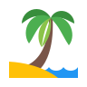

<!-- PROJECT LOGO -->
 

<h3 align="center">Blue Travel | Product Landing Page</h3>

  

    A travel agency webpage
     
     
    <a href="https://adrianogtl.github.io/freecodecamp-product-landing-page/">View Demo</a>
    ·
    <a href="https://www.freecodecamp.org/">freeCodeCamp</a>
  

<!-- TABLE OF CONTENTS -->

  
Table of Contents

  <ol>
    <li>
      <a href="#about-the-project">About The Project</a>
      <ul>
        <li><a href="#built-with">Built With</a></li>
      </ul>
    </li>
    <li><a href="#license">License</a></li>
    <li><a href="#contact">Contact</a></li>
    <li><a href="#acknowledgments">Acknowledgments</a></li>
  </ol>

<!-- ABOUT THE PROJECT -->
## About The Project

* Objective: Build an app that is functionally similar to https://product-landing-page.freecodecamp.rocks

* 4rd certification project in freeCodeCamp's Responsive Web Design curriculum

![Screecast][screencast]

### Built With

* [GitHub Pages][github-pages]
* [GIMP][gimp-url]

<!-- LICENSE -->
## License

Distributed under the MIT License. See [LICENSE][license-url] for more information.

<!-- CONTACT -->
## Contact

Adriano Garcia - [adrianogtlopes@gmail.com](mailto:adrianogtlopes@gmail.com)

<!-- ACKNOWLEDGMENTS -->
## Acknowledgments

* Icons and fonts from [Google ][google-url]
* Icons by [icons8][icons8-url] and [ionicons][ionicons-url]
* Photos by [Allen Dewberry Jr][img1], [Colin Watts][img2], [Vladimir Haltakov][img3]

<a href="#readme-top">back to top</a>

<!-- MARKDOWN LINKS & IMAGES -->
<!-- https://www.markdownguide.org/basic-syntax/#reference-style-links -->

<!-- ABOUT -->
[screencast]: assets/screencast.gif

<!-- BUILT WITH -->
[github-pages]: https://pages.github.com/
[gimp-url]: https://www.gimp.org/

<!-- LICENSE -->
[license-url]: https://github.com/adrianogtl/freecodecamp-product-landing-page/blob/main/LICENSE

<!-- ACKNOWLEDGMENTS -->
[google-url]: https://fonts.google.com/
[ionicons-url]: https://ionic.io/ionicons
[icons8-url]: https://icons8.com/

<!-- Photos -->
[img1]: https://unsplash.com/photos/aerial-photography-of-body-of-water-XjKiG46fkQI
[img2]: https://unsplash.com/photos/boat-on-body-of-water-under-cloudy-sky-M1ObxvsWVhY
[img3]: https://unsplash.com/photos/white-and-blue-boat-on-sea-during-daytime-2SV7Arl6Ndk